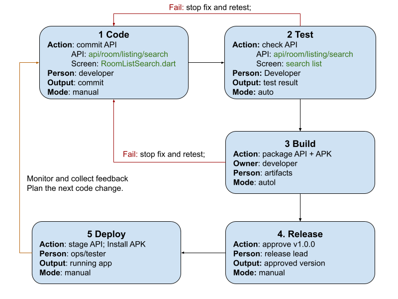

# DevOps Conception Class
- Student: HOEURN LYHOV

## Lesson 2: My CI/CD pipeline
- Project: MeetSpace Management System
- Trigger: Push to `feature/room/search-listing`
- Target: Laravel staging server + Android testing device

### Pipeline design
Code -> Test -> Build -> Release -> Deploy
1. Code: Commit API (`api/room/listing/search`) and Screen (`RoomListSearch.dart`) | Developer | commit | Manual
2. Test: Check API (`api/room/listing/search`) and Screen (`search list`) | Developer | Test result | Auto
3. Build: package API + APK | Artifacts | Commit | Auto
4. Release: Approve v1.0.0 | Release Lead | Approved version | Manual
5. Deploy: Stage API; Install APK | Ops / Tester | Running App | Manual
### Controls
- On test/build failure: Stop fix and retest
- Release approval by: Project Manager / Lead Developer
- After deployment, check: API endpoint & Room search UI
- If it fails: Roll back to prevoius stable release
- Feedback for the next change: Monitor and collect feedback and Plan the next code
- Optional drawing: 

